# Daily Music — Architecture Map

> A navigable map of the app: every screen, the views nested inside it, the
> view-model/store that drives it, the services it calls, and where those land
> in the Supabase backend. Use it to answer "if something's wrong in X, where do
> I look?"
>
> **Snapshot:** generated 2026-06-08 from the source tree. Regenerate when the
> layering changes.
>
> **How to read the diagrams:** Mermaid renders inline on GitHub and in VS Code
> (with a Mermaid preview extension). Arrows point in the direction of
> *dependency / data flow* — `A --> B` means "A uses / renders / calls B".
> Each section ends with a **file index** of clickable links to the source.

---

## 1. The five layers

The app is textbook MVVM + a service layer with a swappable backend. Every
dependency points downward; nothing in a lower layer knows about a higher one.

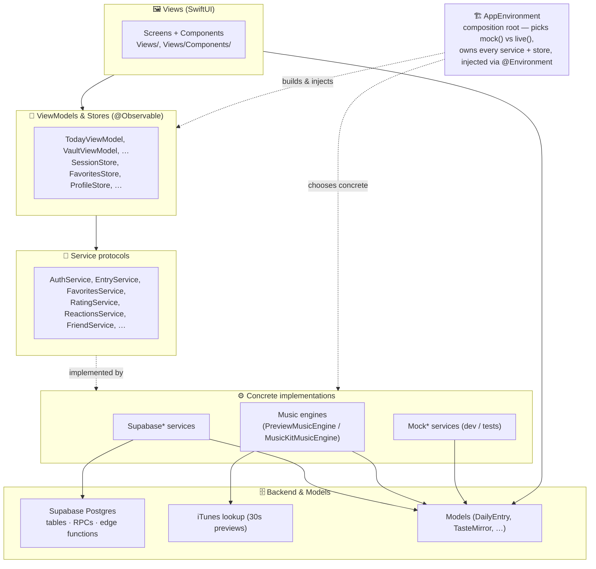

**The one place wiring happens:** [`AppEnvironment`](Daily%20Music/App/AppEnvironment.swift).
`mock()` builds the whole app on sample data; `live()` builds it on Supabase.
Views only ever see the *protocol*, so swapping the entire backend is a
one-line change there. If a screen shows wrong data, the first question is "am I
running `mock()` or `live()`?" — answered in [`Daily_MusicApp`](Daily%20Music/Daily_MusicApp.swift).

---

## 2. Screen map (navigation)

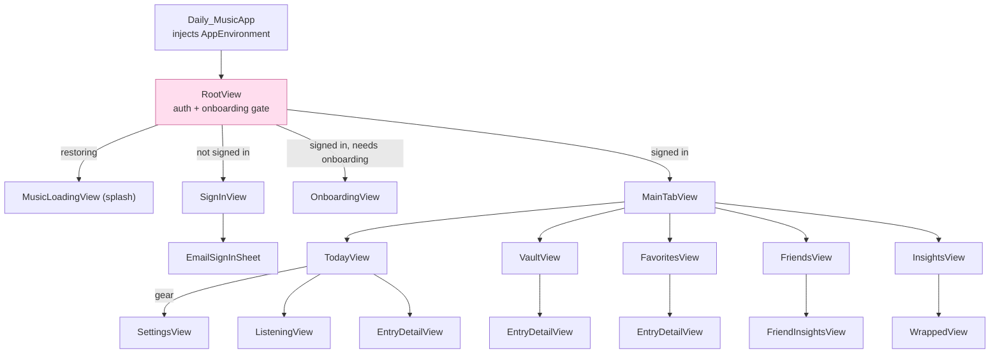

`RootView` is the gate: it restores the session, reconciles onboarding state
against `profiles.onboarded_at`, then routes. Deep links (`dailymusic://friend/…`,
`dailymusic://today`) are captured here via `.onOpenURL`.

**Files:** [Daily_MusicApp](Daily%20Music/Daily_MusicApp.swift) · [RootView](Daily%20Music/App/RootView.swift) · [MainTabView](Daily%20Music/Views/MainTabView.swift)

---

## 3. Feature drill-downs

Each feature diagram shows three bands: **views** (what's rendered), the
**view-model/store** (state), and the **service → backend** (data).

### 3.1 Today

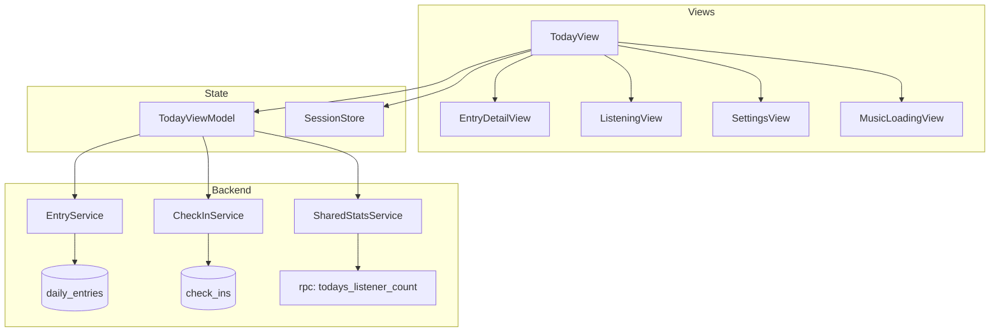

Today's "today's pick" + check-in flow lives in `TodayViewModel`; the listener
count comes from a Postgres RPC, not a table. See [TodayView](Daily%20Music/Views/TodayView.swift) · [TodayViewModel](Daily%20Music/ViewModels/TodayViewModel.swift).

### 3.2 Vault (calendar history)

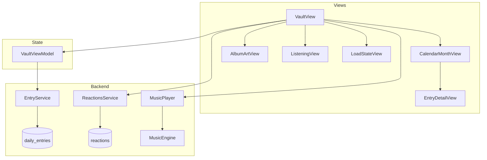

`VaultView` loads its own reactions map directly from `ReactionsService` (not via
the VM) and drives the player. See [VaultView](Daily%20Music/Views/VaultView.swift) · [VaultViewModel](Daily%20Music/ViewModels/VaultViewModel.swift) · [CalendarMonthView](Daily%20Music/Views/Components/CalendarMonthView.swift).

### 3.3 Favorites

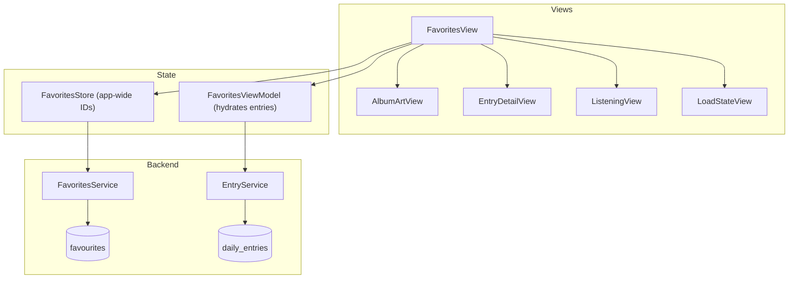

Two-object split: `FavoritesStore` holds the canonical set of favorite IDs
(loaded once in `RootView`, used app-wide incl. the tab badge), while
`FavoritesViewModel` turns those IDs into full `DailyEntry` rows. The view
re-hydrates via `.task(id: env.favoritesStore.ids)`. See [FavoritesView](Daily%20Music/Views/FavoritesView.swift) · [FavoritesStore](Daily%20Music/ViewModels/FavoritesStore.swift) · [FavoritesViewModel](Daily%20Music/ViewModels/FavoritesViewModel.swift).

### 3.4 Friends

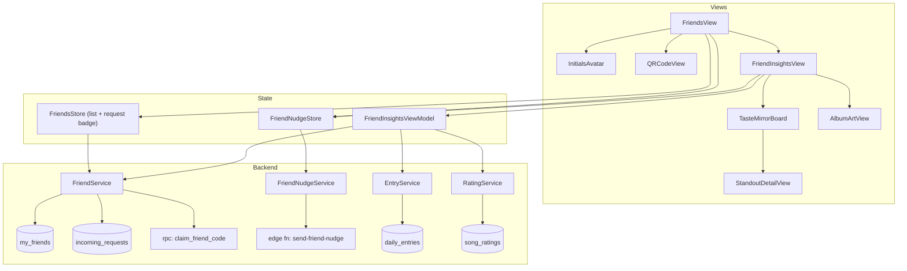

`FriendsStore.requestCount` feeds the tab badge (loaded in `MainTabView`).
Friend codes are claimed through an RPC; nudges go through an **edge function**
(`send-friend-nudge`), the only push-sending path. `FriendInsightsViewModel`
joins your entries + ratings + a friend's to build a `TasteComparison`. See
[FriendsView](Daily%20Music/Views/Friends/FriendsView.swift) · [FriendInsightsView](Daily%20Music/Views/Friends/FriendInsightsView.swift) · [FriendsStore](Daily%20Music/ViewModels/FriendsStore.swift) · [FriendNudgeStore](Daily%20Music/ViewModels/FriendNudgeStore.swift) · [FriendInsightsViewModel](Daily%20Music/ViewModels/FriendInsightsViewModel.swift).

### 3.5 Insights & Wrapped

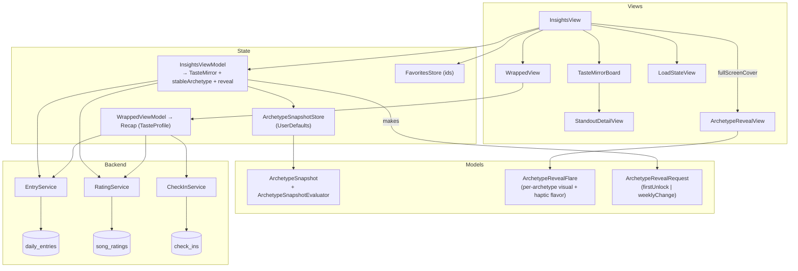

`InsightsViewModel` now also manages **archetype stability**: it calls
`ArchetypeSnapshotStore.evaluate()` on every load to stabilize the displayed
archetype across daily taste changes (updates at most weekly) and gates a
fullscreen reveal animation (`ArchetypeRevealView`) for first-unlock and
weekly-change events. `ArchetypeRevealFlare` maps every `TasteProfile` to its
own particle/light/haptic flavor. The stable archetype is persisted to
`UserDefaults` via `ArchetypeSnapshotStore`; no backend round-trip required.

`InsightsViewModel` produces a `TasteMirror`; `WrappedViewModel` produces a
year-in-review `Recap`. Both read history + ratings; Wrapped also reads
check-ins for streaks. See [InsightsView](Daily%20Music/Views/InsightsView.swift) · [InsightsViewModel](Daily%20Music/ViewModels/InsightsViewModel.swift) · [ArchetypeRevealView](Daily%20Music/Views/Components/ArchetypeRevealView.swift) · [ArchetypeSnapshotStore](Daily%20Music/Services/ArchetypeSnapshotStore.swift) · [ArchetypeSnapshot](Daily%20Music/Models/ArchetypeSnapshot.swift) · [ArchetypeRevealFlare](Daily%20Music/Models/ArchetypeRevealFlare.swift) · [WrappedView](Daily%20Music/Views/WrappedView.swift) · [TasteMirrorBoard](Daily%20Music/Views/Components/TasteMirrorBoard.swift).

### 3.6 Entry detail (the shared content card)

This is the most-reused screen — opened from Today, Vault, Favorites, and the
calendar. It composes most of the app's interactive components.

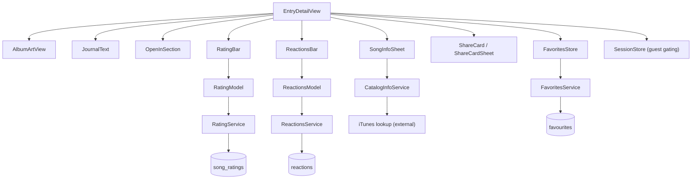

`RatingBar` and `ReactionsBar` each own a small inline model (`RatingModel`,
`ReactionsModel`) created from the env service — so they're self-contained and
reusable. Guest sessions are read-only; the gating reads `SessionStore`. See
[EntryDetailView](Daily%20Music/Views/EntryDetailView.swift) · [RatingBar](Daily%20Music/Views/RatingBar.swift) · [ReactionsBar](Daily%20Music/Views/ReactionsBar.swift) · [SongInfoSheet](Daily%20Music/Views/SongInfoSheet.swift) · [OpenInSection](Daily%20Music/Views/OpenInSection.swift).

### 3.7 Player

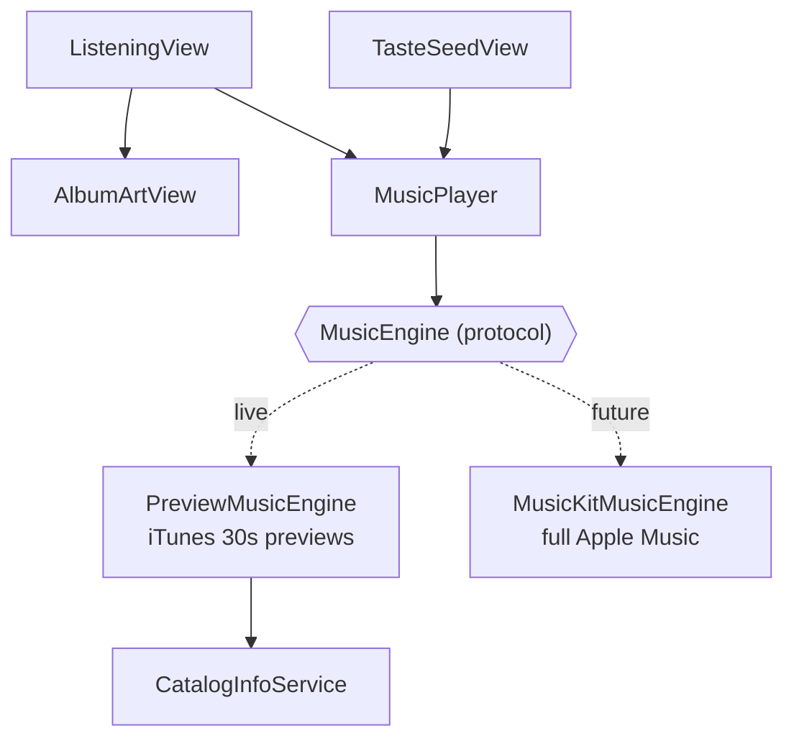

`MusicPlayer` is a thin state wrapper around a swappable `MusicEngine`. Today
`live()` uses `PreviewMusicEngine` (free 30-sec iTunes previews, no paid
account); the MusicKit engine is wired but not enabled. See [ListeningView](Daily%20Music/Views/ListeningView.swift) · [MusicPlayer](Daily%20Music/Services/MusicPlayer.swift) · [PreviewMusicEngine](Daily%20Music/Services/Music/PreviewMusicEngine.swift).

### 3.8 Auth & Onboarding

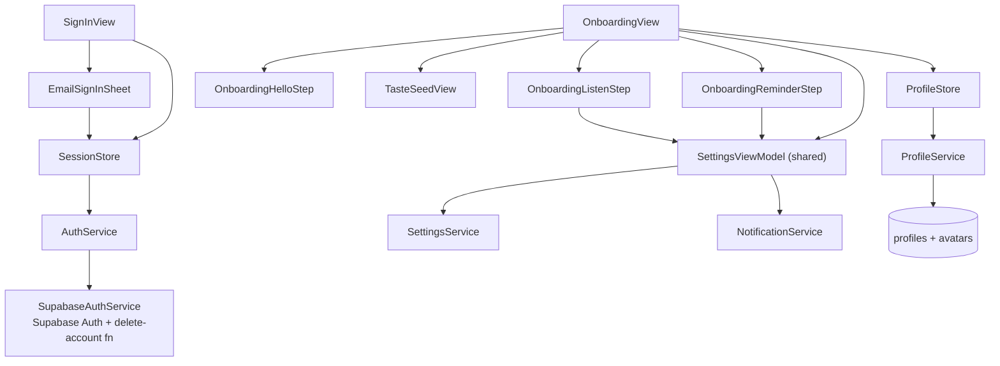

`SessionStore` is the single source of truth for auth (`isSignedIn` drives
`RootView`). Onboarding reuses one `SettingsViewModel` across steps and stamps
completion to `profiles.onboarded_at` via `ProfileStore.markOnboarded()`. See
[SignInView](Daily%20Music/Views/SignInView.swift) · [EmailSignInSheet](Daily%20Music/Views/EmailSignInSheet.swift) · [OnboardingView](Daily%20Music/Views/Onboarding/OnboardingView.swift) · [SessionStore](Daily%20Music/ViewModels/SessionStore.swift).

### 3.9 Settings & Profile

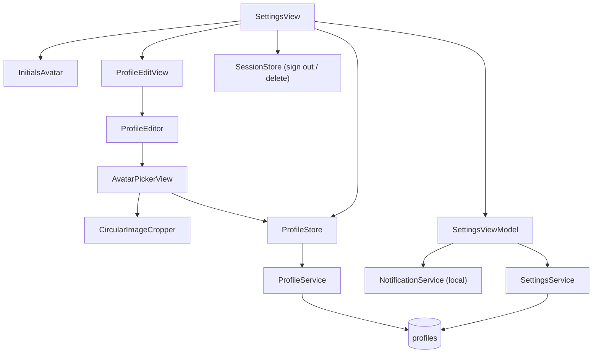

`SettingsViewModel` mirrors settings to `UserDefaults` immediately and debounces
a sync to `profiles`. Avatar upload goes through `ProfileStore.uploadAvatar` →
Supabase storage (`avatars`). See [SettingsView](Daily%20Music/Views/SettingsView.swift) · [SettingsViewModel](Daily%20Music/ViewModels/SettingsViewModel.swift) · [ProfileEditView](Daily%20Music/Views/ProfileEditView.swift) · [AvatarPickerView](Daily%20Music/Views/Components/AvatarPickerView.swift).

---

## 4. Service → backend reference

Every service is a protocol; `live()` binds the `Supabase*` implementation. This
table is the fastest way to go from "this data is wrong" to "this table/RPC".

| Service (protocol) | Live implementation | Backend target |
|---|---|---|
| [AuthService](Daily%20Music/Services/AuthService.swift) | [SupabaseAuthService](Daily%20Music/Services/Supabase/SupabaseAuthService.swift) | Supabase Auth · edge fn `delete-account` |
| [EntryService](Daily%20Music/Services/EntryService.swift) | [SupabaseEntryService](Daily%20Music/Services/Supabase/SupabaseEntryService.swift) | table `daily_entries` |
| [FavoritesService](Daily%20Music/Services/FavoritesService.swift) | [SupabaseFavouritesService](Daily%20Music/Services/Supabase/SupabaseFavouritesService.swift) | table `favourites` |
| [CheckInService](Daily%20Music/Services/CheckInService.swift) | [SupabaseCheckInService](Daily%20Music/Services/Supabase/SupabaseCheckInService.swift) | table `check_ins` |
| [SharedStatsService](Daily%20Music/Services/SharedStatsService.swift) | [SupabaseSharedStatsService](Daily%20Music/Services/Supabase/SupabaseSharedStatsService.swift) | rpc `todays_listener_count` |
| [ReactionsService](Daily%20Music/Services/ReactionsService.swift) | [SupabaseReactionsService](Daily%20Music/Services/Supabase/SupabaseReactionsService.swift) | table `reactions` |
| [RatingService](Daily%20Music/Services/RatingService.swift) | [SupabaseRatingService](Daily%20Music/Services/Supabase/SupabaseRatingService.swift) | table `song_ratings` |
| [CatalogInfoService](Daily%20Music/Services/CatalogInfoService.swift) | `LiveCatalogInfoService` | iTunes lookup API (external) |
| [SettingsService](Daily%20Music/Services/SettingsService.swift) | [SupabaseSettingsService](Daily%20Music/Services/Supabase/SupabaseSettingsService.swift) | table `profiles` |
| [ProfileService](Daily%20Music/Services/ProfileService.swift) | [SupabaseProfileService](Daily%20Music/Services/Supabase/SupabaseProfileService.swift) | table `profiles` · storage `avatars` |
| [FriendService](Daily%20Music/Services/FriendService.swift) | [SupabaseFriendService](Daily%20Music/Services/Supabase/SupabaseFriendService.swift) | `my_friends`, `incoming_requests`, rpc `claim_friend_code` |
| [FriendNudgeService](Daily%20Music/Services/FriendNudgeService.swift) | [SupabaseFriendNudgeService](Daily%20Music/Services/Supabase/SupabaseFriendNudgeService.swift) | edge fn `send-friend-nudge` |
| [NotificationService](Daily%20Music/Services/NotificationService.swift) | `LocalNotificationService` | local (UNUserNotificationCenter) |
| [PushRegistrationService](Daily%20Music/Services/PushRegistrationService.swift) | `SupabasePushRegistrationService` | device-token registration |

Edge functions live in [`supabase/functions/`](supabase/functions): `delete-account`, `send-friend-nudge`.

---

## 5. Model dependency graph

Models are plain data. Arrows = "references / contains".

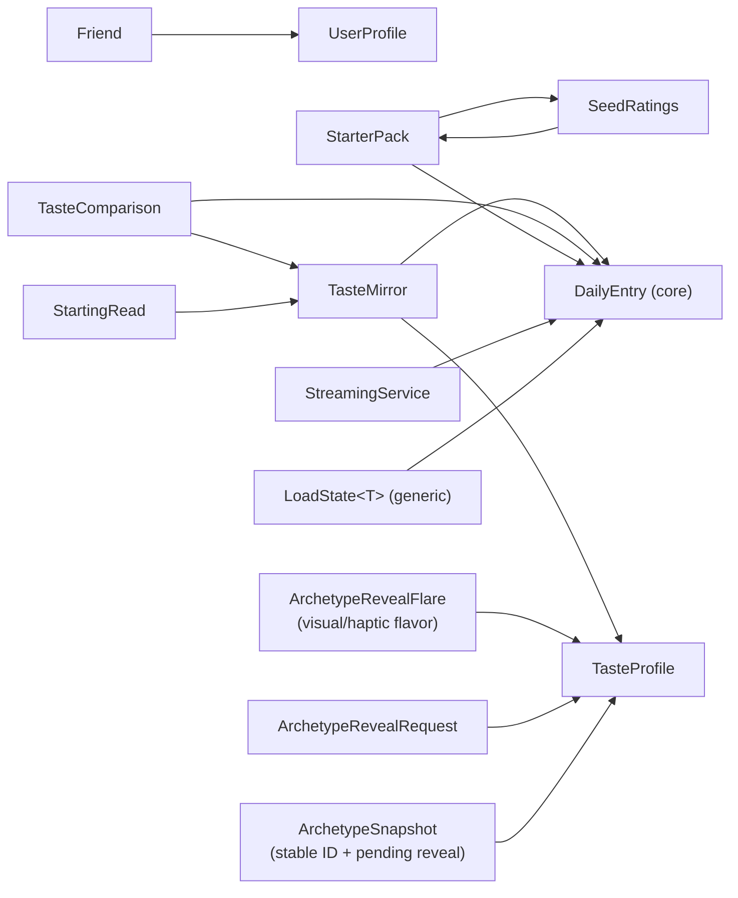

`DailyEntry` is the hub model — almost everything references it.
`TasteMirror` (the insights payload) and `TasteComparison` (friend insights) are
the two derived aggregates. `ArchetypeSnapshot` stabilizes the displayed
archetype (persisted via `ArchetypeSnapshotStore`); `ArchetypeRevealFlare`
provides per-archetype visual/haptic data for the reveal animation. See [Models/](Daily%20Music/Models).

---

## 6. Quick "where do I look?" index

| Symptom | Start here |
|---|---|
| Wrong data everywhere / mock vs live | [AppEnvironment](Daily%20Music/App/AppEnvironment.swift), [Daily_MusicApp](Daily%20Music/Daily_MusicApp.swift) |
| Stuck on splash / wrong screen after launch | [RootView](Daily%20Music/App/RootView.swift) (`resolveLaunchState`) |
| Sign-in / session issues | [SessionStore](Daily%20Music/ViewModels/SessionStore.swift) → [SupabaseAuthService](Daily%20Music/Services/Supabase/SupabaseAuthService.swift) |
| Onboarding re-appears / won't dismiss | [RootView](Daily%20Music/App/RootView.swift) `needsOnboarding` + [OnboardingConfig](Daily%20Music/App/OnboardingConfig.swift) + `profiles.onboarded_at` |
| Today's pick / check-in wrong | [TodayViewModel](Daily%20Music/ViewModels/TodayViewModel.swift) |
| Calendar / history gaps | [VaultViewModel](Daily%20Music/ViewModels/VaultViewModel.swift), `daily_entries` |
| Favorite toggling not sticking | [FavoritesStore](Daily%20Music/ViewModels/FavoritesStore.swift) + `favourites` table |
| Ratings / reactions not saving | [RatingBar](Daily%20Music/Views/RatingBar.swift) / [ReactionsBar](Daily%20Music/Views/ReactionsBar.swift) (inline models) |
| Friend requests / badge wrong | [FriendsStore](Daily%20Music/ViewModels/FriendsStore.swift), `my_friends` / `incoming_requests` |
| Nudges not sending | [FriendNudgeStore](Daily%20Music/ViewModels/FriendNudgeStore.swift) → edge fn `send-friend-nudge` |
| Playback silent / wrong track | [MusicPlayer](Daily%20Music/Services/MusicPlayer.swift) + [PreviewMusicEngine](Daily%20Music/Services/Music/PreviewMusicEngine.swift) |
| Settings not persisting | [SettingsViewModel](Daily%20Music/ViewModels/SettingsViewModel.swift) (UserDefaults + debounced `profiles` sync) |
| Avatar upload fails | [AvatarPickerView](Daily%20Music/Views/Components/AvatarPickerView.swift) → [ProfileStore](Daily%20Music/ViewModels/ProfileStore.swift) → storage `avatars` |
| `PGRST204` errors | a SQL migration wasn't applied in the Supabase dashboard (see CLAUDE/memory) |
| Archetype reveal never fires / fires again after 7 days | [ArchetypeSnapshot](Daily%20Music/Models/ArchetypeSnapshot.swift) (`ArchetypeSnapshotEvaluator`) + [ArchetypeSnapshotStore](Daily%20Music/Services/ArchetypeSnapshotStore.swift) (`UserDefaults` key `insights.archetypeSnapshot`) |
| Wrong archetype shown on Insights screen | [InsightsViewModel](Daily%20Music/ViewModels/InsightsViewModel.swift) `stableArchetype` — comes from snapshot, not live mirror |
| Archetype reveal animation looks wrong / missing flare | [ArchetypeRevealFlare](Daily%20Music/Models/ArchetypeRevealFlare.swift) `flares` dict — check that the `TasteProfile` has an entry |
| Glass effects not rendering | [Styles.swift](Daily%20Music/DesignSystem/Styles.swift) — requires iOS 26+ (`glassEffect` API) |
