# Daily Music — Architecture Map

> A navigable map of the app: every screen, the views nested inside it, the
> view-model/store that drives it, the services it calls, and where those land
> in the Supabase backend. Use it to answer "if something's wrong in X, where do
> I look?"
>
> **Snapshot:** generated 2026-06-10 from the source tree. Regenerate when the
> layering changes.
>
> **How to read the diagrams:** Mermaid renders inline on GitHub and in VS Code
> (with a Mermaid preview extension). Arrows point in the direction of
> *dependency / data flow* — `A --> B` means "A uses / renders / calls B".
> Each section ends with a **file index** of clickable links to the source.

---

## 1. The five layers

The app is textbook MVVM + a service layer with a swappable backend. Every
dependency points downward; nothing in a lower layer knows about a higher one.

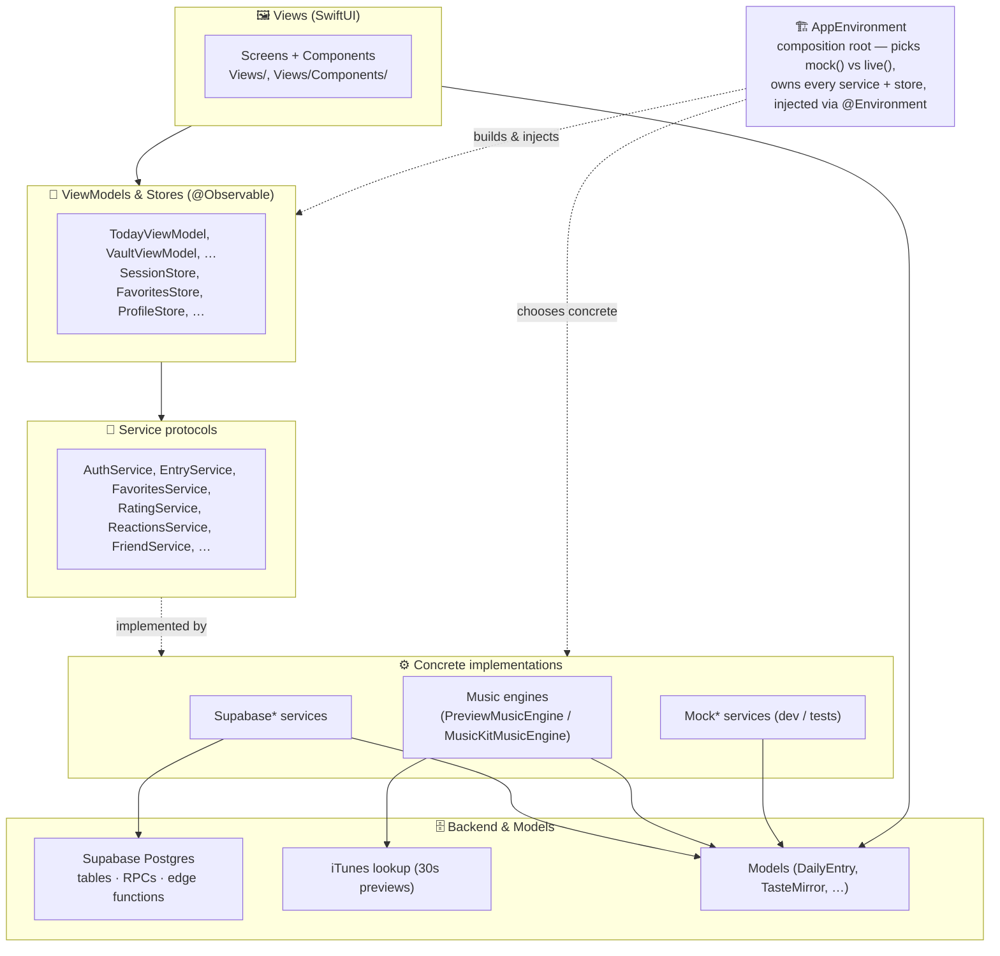

**The one place wiring happens:** [`AppEnvironment`](Daily%20Music/App/AppEnvironment.swift).
`mock()` builds the whole app on sample data; `live()` builds it on Supabase.
Views only ever see the *protocol*, so swapping the entire backend is a
one-line change there. If a screen shows wrong data, the first question is "am I
running `mock()` or `live()`?" — answered in [`Daily_MusicApp`](Daily%20Music/Daily_MusicApp.swift).

---

## 2. Screen map (navigation)

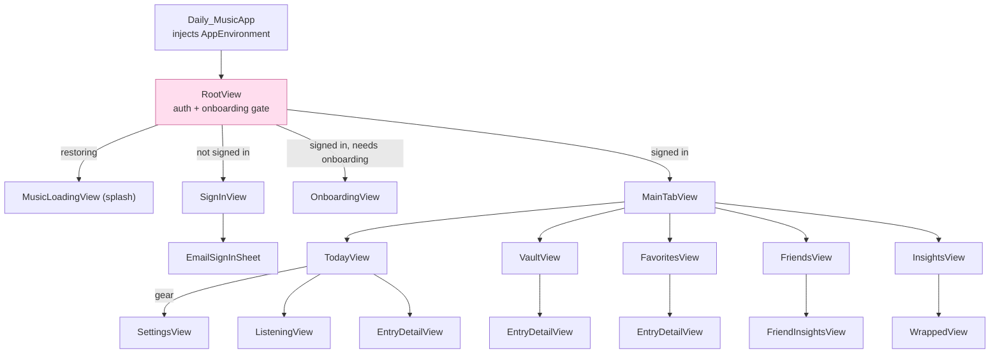

`RootView` is the gate: it restores the session, reconciles onboarding state
against `profiles.onboarded_at`, then routes. Deep links (`dailymusic://friend/…`,
`dailymusic://today`, `dailymusic://wrapped` — the last fired by the
1st-of-month recap notification, landing on Insights with last month's Wrapped
presented) are captured here via `.onOpenURL`.

**Files:** [Daily_MusicApp](Daily%20Music/Daily_MusicApp.swift) · [RootView](Daily%20Music/App/RootView.swift) · [MainTabView](Daily%20Music/Views/MainTabView.swift)

---

## 3. Feature drill-downs

Each feature diagram shows three bands: **views** (what's rendered), the
**view-model/store** (state), and the **service → backend** (data).

### 3.1 Today

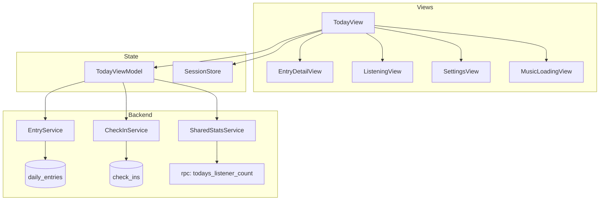

Today's "today's pick" + check-in flow lives in `TodayViewModel`; the listener
count comes from a Postgres RPC, not a table. After recording the check-in the
VM also computes a [`Streak`](Daily%20Music/Models/Streak.swift) (current run /
best run / milestone progress) from `CheckInService.checkInDates()`, shown as
the flame pill in Today's toolbar (`TodayToolbarStreakBadge`). See
[TodayView](Daily%20Music/Views/TodayView.swift) · [TodayViewModel](Daily%20Music/ViewModels/TodayViewModel.swift).

### 3.2 Vault (calendar history)

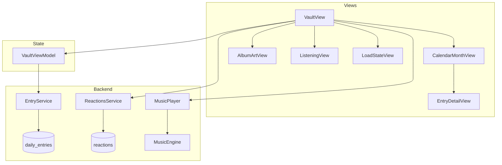

`VaultView` loads its own reactions map directly from `ReactionsService` (not via
the VM) and drives the player. The hero renders through the shared
[HeroCard](Daily%20Music/Views/Components/HeroCard.swift) gradient-stage scaffold
and is data-driven via the shared
[CatchUp](Daily%20Music/Models/CatchUp.swift) rule: last week's entries on days
with no check-in, minus ones already opened in the Vault (`CatchUpLog`, a
UserDefaults-backed store on `AppEnvironment`). The same rule feeds the Vault
tab badge in `MainTabView`, so catching up clears both live. "Recent picks →
See all" pushes `VaultAllSongsView`, the full searchable archive
(title/artist/genre/mood). See [VaultView](Daily%20Music/Views/VaultView.swift) · [VaultViewModel](Daily%20Music/ViewModels/VaultViewModel.swift) · [CalendarMonthView](Daily%20Music/Views/Components/CalendarMonthView.swift).

### 3.3 Favorites

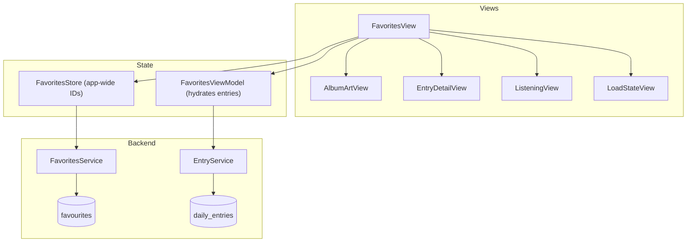

Two-object split: `FavoritesStore` holds the canonical set of favorite IDs
(loaded once in `RootView`, used app-wide incl. the tab badge), while
`FavoritesViewModel` turns those IDs into full `DailyEntry` rows. The view
re-hydrates via `.task(id: env.favoritesStore.ids)`. See [FavoritesView](Daily%20Music/Views/FavoritesView.swift) · [FavoritesStore](Daily%20Music/ViewModels/FavoritesStore.swift) · [FavoritesViewModel](Daily%20Music/ViewModels/FavoritesViewModel.swift).

### 3.4 Friends

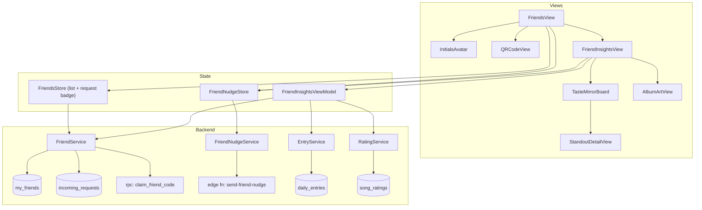

`FriendsStore.requestCount` feeds the tab badge (loaded in `MainTabView`).
Friend codes are claimed through an RPC; nudges go through an **edge function**
(`send-friend-nudge`), the only push-sending path. `FriendInsightsViewModel`
joins your entries + ratings + a friend's to build a `TasteComparison`. See
[FriendsView](Daily%20Music/Views/Friends/FriendsView.swift) · [FriendInsightsView](Daily%20Music/Views/Friends/FriendInsightsView.swift) · [FriendsStore](Daily%20Music/ViewModels/FriendsStore.swift) · [FriendNudgeStore](Daily%20Music/ViewModels/FriendNudgeStore.swift) · [FriendInsightsViewModel](Daily%20Music/ViewModels/FriendInsightsViewModel.swift).

### 3.5 Insights & Wrapped

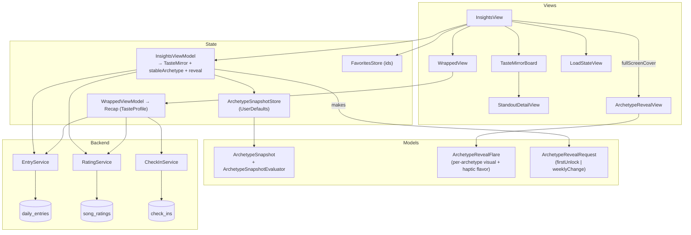

`InsightsViewModel.load(favoriteIDs:)` builds `[RatedSong]` from history +
ratings + hearts: thumbed songs carry their rating and `isFavorite` flag;
favorited-but-unrated songs join as value-0 heart-only signal so the scorer
hears them without distorting the tile math. The array (+ `SeedRatings`) is
passed to `TasteMirror.build(from:incumbentID:)` together with the snapshot
store's incumbent ID for hysteresis.

**Archetype Engine v2** (`ArchetypeAffinity.swift`): `ArchetypeScorer` computes
per-archetype affinity scores by dot-producting the user's recency-weighted,
Laplace-smoothed like-rates against each archetype's weight vectors over moods,
energy bands, themes, and genres. `isFavorite` adds a +0.75 boost on top of a 👍.
The winner needs `scoreFloor = 0.02` to beat The Shapeshifter, and must clear the
incumbent by `stickyMargin = 0.015` (hysteresis). Evidence facts (top
contributing dimension/category with raw counts) surface as receipts in the hero
card and as the archetype reveal reason. `TasteProfile` has 11 identities (10
affinity-scored + The Shapeshifter fallback) including the new **The Pophead**
(`the_pophead`, genre-anchored).

**Driver-first board** ([DriverHighlights](Daily%20Music/Models/DriverHighlights.swift) ·
[BoardEntranceFlavor](Daily%20Music/Models/BoardEntranceFlavor.swift)):
`DriverHighlights.compute` maps the evidence facts to `[dimensionID: DriverHighlight]`
(rank + fact), suppressed when the displayed (weekly-stable) archetype differs from the
live winner. `TasteMirrorBoard` renders hierarchy by size: a full-width #1 driver card
(receipt line via `driverReceiptCopy` in `ArchetypeCopy.swift`) + half-width #2/#3 cards,
with all non-driver dimensions demoted to quiet one-line rows. The entrance is
archetype-flavored: `BoardEntranceFlavor` maps the reveal `LightStyle` to a one-shot hero
bloom, the #1 card gets a shimmer sweep + `Haptics.driverReward` beat — played once per
archetype per app session. The hero absorbs Insights' replay button and reveal countdown.

`InsightsViewModel` also manages **archetype stability**: `ArchetypeSnapshotStore.evaluate()` stabilizes the displayed archetype (updates at most weekly) and gates a fullscreen reveal animation (`ArchetypeRevealView`) for first-unlock and weekly-change events. `ArchetypeRevealFlare` maps every `TasteProfile` to its own particle/light/haptic flavor. Persisted to `UserDefaults`; no backend round-trip.

`InsightsViewModel` produces a `TasteMirror`; `WrappedViewModel` produces a
year-in-review `Recap`. Both read history + ratings; Wrapped also reads
check-ins for streaks. See [InsightsView](Daily%20Music/Views/InsightsView.swift) · [InsightsViewModel](Daily%20Music/ViewModels/InsightsViewModel.swift) · [ArchetypeAffinity](Daily%20Music/Models/ArchetypeAffinity.swift) · [TasteMirror](Daily%20Music/Models/TasteMirror.swift) · [ArchetypeRevealView](Daily%20Music/Views/Components/ArchetypeRevealView.swift) · [ArchetypeSnapshotStore](Daily%20Music/Services/ArchetypeSnapshotStore.swift) · [ArchetypeSnapshot](Daily%20Music/Models/ArchetypeSnapshot.swift) · [ArchetypeRevealFlare](Daily%20Music/Models/ArchetypeRevealFlare.swift) · [WrappedView](Daily%20Music/Views/WrappedView.swift) · [TasteMirrorBoard](Daily%20Music/Views/Components/TasteMirrorBoard.swift).

**Badges (gamification).** A habit-reward layer on Insights, fully *derived*
from data already synced — no backend table (spec Approach C: a `BadgeService`
protocol seam reserves a future Supabase/friend-profile source). Data flow:
the live stores → a `BadgeInputs` snapshot → the pure `BadgeDeriver` →
`[EarnedBadge]` → `BadgesViewModel` → an Insights summary card / the full
`BadgesView`. Six **tiered** badges (streak, mint, crate, saves, ratings,
rescues — each with a threshold ladder + progress) and six one-time **moment**
badges (first mint, perfect week, comeback, night owl, flawless month, archetype
revealed — hidden as "?" until earned). `BadgeDeriver` reuses `Streak.compute`
and `ListenStatus.of` rather than re-deriving state, so it stays pure and
fixture-tested ([BadgeTests](Daily%20MusicTests/BadgeTests.swift)).
`BadgeSeenStore` (UserDefaults) records already-celebrated badge+tier keys to
drive a lightweight earn celebration ([BadgeCelebrationCard](Daily%20Music/Views/Components/BadgeCelebrationCard.swift),
one card at a time); it baselines silently on first run so existing users aren't
spammed, and it never affects whether a badge is *earned* — only whether it's
celebrated. See [Badge](Daily%20Music/Models/Badge.swift) · [BadgeInputs](Daily%20Music/Models/BadgeInputs.swift) · [BadgeDeriver](Daily%20Music/Services/BadgeDeriver.swift) · [BadgeService](Daily%20Music/Services/BadgeService.swift) · [BadgeSeenStore](Daily%20Music/Services/BadgeSeenStore.swift) · [BadgesViewModel](Daily%20Music/ViewModels/BadgesViewModel.swift) · [BadgesView](Daily%20Music/Views/BadgesView.swift).

### 3.6 Entry detail (the shared content card)

This is the most-reused screen — opened from Today, Vault, Favorites, and the
calendar. It composes most of the app's interactive components.

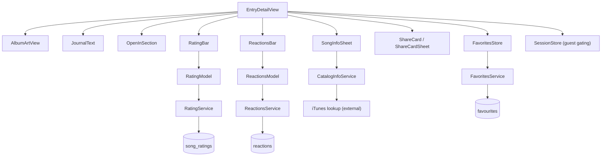

`RatingBar` and `ReactionsBar` each own a small inline model (`RatingModel`,
`ReactionsModel`) created from the env service — so they're self-contained and
reusable. Guest sessions are read-only; the gating reads `SessionStore`.
The action cluster also holds a save-to-Apple-Music button, shown only when
`AppleMusicSession` grants `.librarySave` (connected + subscribed); a
successful save is remembered in `SavedTracksLog` so the button shows
"Added ✓" and never double-adds to the playlist.

The view is split across three files (all extensions of one `EntryDetailView`
type): the main file holds the public view, standard layout, and shared
backdrop/headers; [EntryDetailImmersive](Daily%20Music/Views/EntryDetailImmersive.swift)
holds the two-zone snap layout Today uses (plus the snap scroll behavior and
the journal preview dock, whose opacity tracks scroll offset so it fades out
as the journal rises and back in on return — preview text comes from
[JournalPreview](Daily%20Music/Models/JournalPreview.swift));
[EntryActionCluster](Daily%20Music/Views/EntryActionCluster.swift) holds the
favorite/rating/reaction/info controls in full-size and compact variants. See
[EntryDetailView](Daily%20Music/Views/EntryDetailView.swift) · [RatingBar](Daily%20Music/Views/RatingBar.swift) · [ReactionsBar](Daily%20Music/Views/ReactionsBar.swift) · [SongInfoSheet](Daily%20Music/Views/SongInfoSheet.swift) · [OpenInSection](Daily%20Music/Views/OpenInSection.swift).

### 3.7 Player

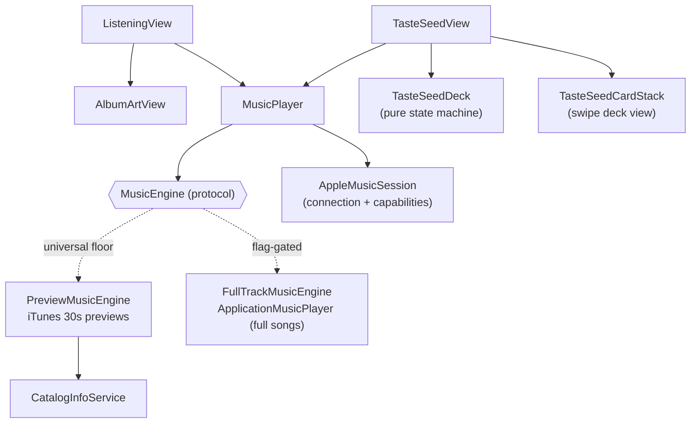

`MusicPlayer` is a thin state wrapper holding **two** engines: the universal
`PreviewMusicEngine` (free 30-sec iTunes previews) and an optional
`FullTrackMusicEngine` (full songs via `ApplicationMusicPlayer`; only wired in
`live()` when `FeatureFlags.appleMusicConnect` is on). Every play call carries
a `PlaybackContext`: `.standard` (ceremony, entry detail, vault) routes to the
full engine **iff** [`AppleMusicSession`](Daily%20Music/Services/Music/AppleMusicSession.swift)
reports the `.fullPlayback` capability (connected + subscribed); `.sample`
(taste-seed deck) always plays previews. Any full-engine failure falls back to
the preview engine in the same call — previews are the floor, never an error.
`isPlayingFullTrack` tells the UI which it got. The engine protocol
distinguishes `play()` (fresh start) from `resume()` (continue after pause) —
pause/play must NOT restart the clip — and `MusicPlayer.restart()` backs the
player's back-to-start button.

**Library saves** route through the connection layer, not the engines:
`MusicServiceConnection.saveToLibrary(_:)` is implemented by each session and
the entry-detail save button asks `AppEnvironment.librarySaveService` (first
connected service granting `.librarySave`) — so Apple Music and Spotify are
symmetric, and engines are pure playback.

**Spotify connection** (`SpotifySession` + `SpotifyAuthenticator` +
`SpotifyLibraryAPI`, in `Services/Music/Spotify/`): **live, no feature flag.**
Explicit connect via OAuth PKCE (`ASWebAuthenticationSession`,
`dailymusic://spotify-callback`, no client secret anywhere); tokens live in
the Keychain (`daily-music.spotify`) with rotating refresh. Capabilities are
`[.librarySave]` only — Spotify offers third-party apps no in-app playback and
no rich metadata. Saves find-or-create a private "Daily Music" playlist
(playlist ID cached in UserDefaults `spotify.dailyPlaylistID`; 404 re-resolves
once). A rejected refresh quietly drops the session to `.notConnected`.
Dev-mode caveat: until Spotify's extended-quota review, only allowlisted
accounts (~25) can connect.

**Apple Music connection** (`AppleMusicSession`, on `AppEnvironment`): an
explicit user "Connect" (Settings → Connected services, or the optional
onboarding nudge) runs MusicKit authorization + a subscription check and maps
the result to capabilities — subscribed → `.fullPlayback + .librarySave +
.richMetadata`; authorized-but-unsubscribed → `.richMetadata` only. The
connected flag persists in UserDefaults; `RootView` calls `restore()` on launch
(silent, never prompts) and a `subscriptionUpdates` watcher downgrades
capabilities live if the subscription lapses. MusicKit statics sit behind the
`AppleMusicAuthorizing` seam (`MusicKitAuthorizer` live /
`MockAppleMusicAuthorizer` in `mock()` + tests). **Everything is dormant until
`FeatureFlags.appleMusicConnect` flips** — activation checklist in
[FullTrackMusicEngine](Daily%20Music/Services/Music/FullTrackMusicEngine.swift).

`ListeningView` doubles as the **first-listen ceremony**: when opened with
`showsRevealIntro` (auto-open from Today only), it holds on an intro beat
("Your song of the day", tap to skip) before revealing the artwork and starting
playback. Manual opens skip the intro. Advancing to the story stops playback
(TodayView's `onAdvance`).

**Today ↔ Listening transition:** interactive and finger-tracked, driven by a
single `presentation` value (0 = absent, 1 = up) that `TodayView` owns and binds
into `ListeningView`. The pure commit/cancel decision and gesture→progress
mappings live in [ListeningTransition.swift](Daily%20Music/Views/Components/ListeningTransition.swift)
(`TransitionResolver` / `TransitionMath`, unit-tested). **Enter** keeps the
pull-down ceremony: the journal over-pull reports live `pullProgress` so Today's
content recedes, and commits at a fraction (springing `presentation` 0→1).
**Exit** is **swipe-down to dismiss** (platform convention): the player foreground
tracks the finger down and fades while the bloom only changes opacity — it is
never repositioned (translating that `blur(radius:90)` layer dropped frames, so
opacity carries the cross-dissolve). Release commits or snaps back by distance +
velocity. Reduce Motion uses an opacity-only path.

**Taste seed auto-play + loop:** `TasteSeedView` owns the intro → rating → reveal phase machine and a `TasteSeedDeck` state machine (which card is front, which peek behind, what's been judged). `TasteSeedCardStack` is a dumb swipe view: drag with rotation, INTO IT / NAH badge, fling past threshold. When the rating phase starts (Begin tapped), the front card's preview starts automatically; when `MusicPlayer` reports `.finished`, `toggle(current)` is called again — `toggle` from `.finished` replays fresh, implementing the loop. Judging advances the deck and starts the next card's preview via `toggle`. Compact 👍/👎 fallback buttons stay for accessibility and Reduce Motion.

See [ListeningView](Daily%20Music/Views/ListeningView.swift) · [MusicPlayer](Daily%20Music/Services/MusicPlayer.swift) · [PreviewMusicEngine](Daily%20Music/Services/Music/PreviewMusicEngine.swift) · [TasteSeedView](Daily%20Music/Views/Onboarding/TasteSeedView.swift) · [TasteSeedDeck](Daily%20Music/Models/TasteSeedDeck.swift) · [TasteSeedCardStack](Daily%20Music/Views/Onboarding/TasteSeedCardStack.swift).

### 3.8 Auth & Onboarding

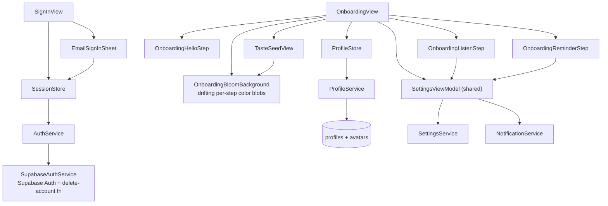

`SessionStore` is the single source of truth for auth (`isSignedIn` drives
`RootView`). Onboarding reuses one `SettingsViewModel` across steps and stamps
completion to `profiles.onboarded_at` via `ProfileStore.markOnboarded()`.

**Bloom look:** every onboarding surface sits on `OnboardingBloomBackground` —
three blurred circles drifting over an adaptive base (light/dark; `forceDark`
while rating), with a per-step palette/accent (violet → cyan → amber) and an
artwork-tinted palette during the taste-seed rating (via `ArtworkPalette`).
Content floats on `glassCard()` (in `DesignSystem/Styles.swift`). The listen
step is **not skippable** (`preferredStreamingService` defaults to Apple Music);
after a successful Finish, a "You're all set" send-off holds the wizard and its
**Hear today's song** button flips `hasCompletedOnboarding` +
`launchIntoCeremony`, dropping the user straight into the ceremony.

**Day-one ceremony handoff:** when the taste-seed reveal completes (`TasteSeedView` fires `onComplete`), `OnboardingView` sets `AppEnvironment.launchIntoCeremony = true`. `TodayView`'s `.onChange(of: loadedEntry?.id)` consumes this flag: if set, it clears it and opens the ceremony with `ListeningCeremony.autoOpenDelay(launchingFromOnboarding: true)` (`.zero`) — skipping the normal 0.6s settle beat so the arc (rate 10 songs → archetype reveal → today's first song) is unbroken. The flag is one-shot; every subsequent day uses the normal delayed rise.

See [SignInView](Daily%20Music/Views/SignInView.swift) · [EmailSignInSheet](Daily%20Music/Views/EmailSignInSheet.swift) · [OnboardingView](Daily%20Music/Views/Onboarding/OnboardingView.swift) · [SessionStore](Daily%20Music/ViewModels/SessionStore.swift) · [ListeningCeremony](Daily%20Music/Models/ListeningCeremony.swift).

### 3.9 Settings & Profile

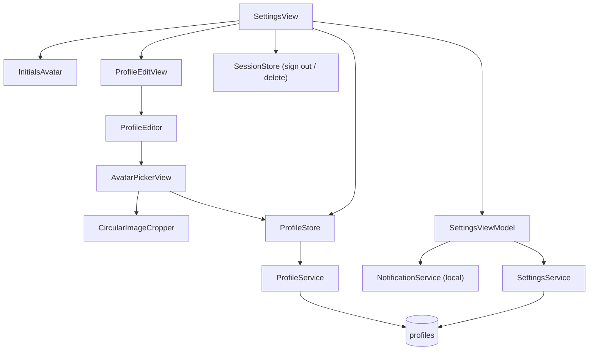

`SettingsViewModel` mirrors settings to `UserDefaults` immediately and debounces
a sync to `profiles`. Avatar upload goes through `ProfileStore.uploadAvatar` →
Supabase storage (`avatars`). See [SettingsView](Daily%20Music/Views/SettingsView.swift) · [SettingsViewModel](Daily%20Music/ViewModels/SettingsViewModel.swift) · [ProfileEditView](Daily%20Music/Views/ProfileEditView.swift) · [AvatarPickerView](Daily%20Music/Views/Components/AvatarPickerView.swift).

---

## 4. Service → backend reference

Every service is a protocol; `live()` binds the `Supabase*` implementation. This
table is the fastest way to go from "this data is wrong" to "this table/RPC".

| Service (protocol) | Live implementation | Backend target |
|---|---|---|
| [AuthService](Daily%20Music/Services/AuthService.swift) | [SupabaseAuthService](Daily%20Music/Services/Supabase/SupabaseAuthService.swift) | Supabase Auth · edge fn `delete-account` |
| [EntryService](Daily%20Music/Services/EntryService.swift) | [SupabaseEntryService](Daily%20Music/Services/Supabase/SupabaseEntryService.swift) | table `daily_entries` |
| [FavoritesService](Daily%20Music/Services/FavoritesService.swift) | [SupabaseFavouritesService](Daily%20Music/Services/Supabase/SupabaseFavouritesService.swift) | table `favourites` |
| [CheckInService](Daily%20Music/Services/CheckInService.swift) | [SupabaseCheckInService](Daily%20Music/Services/Supabase/SupabaseCheckInService.swift) | table `check_ins` |
| [SharedStatsService](Daily%20Music/Services/SharedStatsService.swift) | [SupabaseSharedStatsService](Daily%20Music/Services/Supabase/SupabaseSharedStatsService.swift) | rpc `todays_listener_count` · rpc `listener_count_on` (archive days; SQL in `docs/superpowers/specs/archive-listener-counts.sql`) |
| [ReactionsService](Daily%20Music/Services/ReactionsService.swift) | [SupabaseReactionsService](Daily%20Music/Services/Supabase/SupabaseReactionsService.swift) | table `reactions` |
| [RatingService](Daily%20Music/Services/RatingService.swift) | [SupabaseRatingService](Daily%20Music/Services/Supabase/SupabaseRatingService.swift) | table `song_ratings` |
| [CatalogInfoService](Daily%20Music/Services/CatalogInfoService.swift) | `LiveCatalogInfoService` (wrapped by `EnrichedCatalogInfoService` when `FeatureFlags.appleMusicConnect`) | iTunes lookup API (external) · MusicKit catalog extras (editorial notes, hi-res art) when connected |
| [MusicServiceConnection](Daily%20Music/Services/Music/MusicServiceConnection.swift) | [AppleMusicSession](Daily%20Music/Services/Music/AppleMusicSession.swift) | MusicKit auth + subscription via `AppleMusicAuthorizing` seam · library writes via `AppleMusicLibraryWriting` · UserDefaults `appleMusic.userConnected` |
| [MusicServiceConnection](Daily%20Music/Services/Music/MusicServiceConnection.swift) | [SpotifySession](Daily%20Music/Services/Music/Spotify/SpotifySession.swift) | OAuth PKCE ([SpotifyAuthenticator](Daily%20Music/Services/Music/Spotify/SpotifyAuthenticator.swift)) · Keychain `daily-music.spotify` · Web API ([SpotifyLibraryAPI](Daily%20Music/Services/Music/Spotify/SpotifyLibraryAPI.swift)) · UserDefaults `spotify.dailyPlaylistID` |
| — ([SavedTracksLog](Daily%20Music/Models/SavedTracksLog.swift), store) | — | UserDefaults `appleMusic.savedEntryIDs` (playlist-save state) |
| [SettingsService](Daily%20Music/Services/SettingsService.swift) | [SupabaseSettingsService](Daily%20Music/Services/Supabase/SupabaseSettingsService.swift) | table `profiles` |
| [ProfileService](Daily%20Music/Services/ProfileService.swift) | [SupabaseProfileService](Daily%20Music/Services/Supabase/SupabaseProfileService.swift) | table `profiles` · storage `avatars` |
| [FriendService](Daily%20Music/Services/FriendService.swift) | [SupabaseFriendService](Daily%20Music/Services/Supabase/SupabaseFriendService.swift) | `my_friends`, `incoming_requests`, rpc `claim_friend_code` |
| [FriendNudgeService](Daily%20Music/Services/FriendNudgeService.swift) | [SupabaseFriendNudgeService](Daily%20Music/Services/Supabase/SupabaseFriendNudgeService.swift) | edge fn `send-friend-nudge` |
| [NotificationService](Daily%20Music/Services/NotificationService.swift) | `LocalNotificationService` | local (UNUserNotificationCenter) — schedules a rolling 14-day window of dated reminders with rotating copy from [ReminderCopy](Daily%20Music/Models/ReminderCopy.swift); the soonest one carries the live streak. Refreshed on app open by `MainTabView.refreshReminderWindow()` |
| [PushRegistrationService](Daily%20Music/Services/PushRegistrationService.swift) | `SupabasePushRegistrationService` | device-token registration |

Edge functions live in [`supabase/functions/`](supabase/functions): `delete-account`, `send-friend-nudge`.

### Widget extension

[`DailyMusicWidget/`](DailyMusicWidget) is a separate WidgetKit target
(`DailyMusicWidgetExtension`, embedded in the app). "Today's Drop" shows
today's pick on the Home/Lock Screen (small, medium, accessory-rectangular).
Its timeline provider fetches the public `daily_entries` row straight from
Supabase REST with the anon key (no app group needed — same public data the
sign-in cover wall reads) and refreshes after local midnight, or every 30 min
until the drop lands. Tapping deep-links `dailymusic://today` (handled in
`RootView`; the scheme is registered via the app's partial
[`Info.plist`](Daily%20Music/Info.plist), merged into the generated one). The
widget keeps its own gitignored `SupabaseConfig.swift` copy.

Both targets share the App Group `group.maxhagi.Daily-Music` (entitlements files
at each target root). The app publishes a streak snapshot into it via
[SharedStreak](Daily%20Music/Services/SharedStreak.swift) (called from
`TodayViewModel` and `MainTabView`), and the widget reads it through its own
`SharedStreakReader` — hiding the flame past the snapshot's valid-through day
so it never shows a streak that may have silently broken.

---

## 5. Model dependency graph

Models are plain data. Arrows = "references / contains".

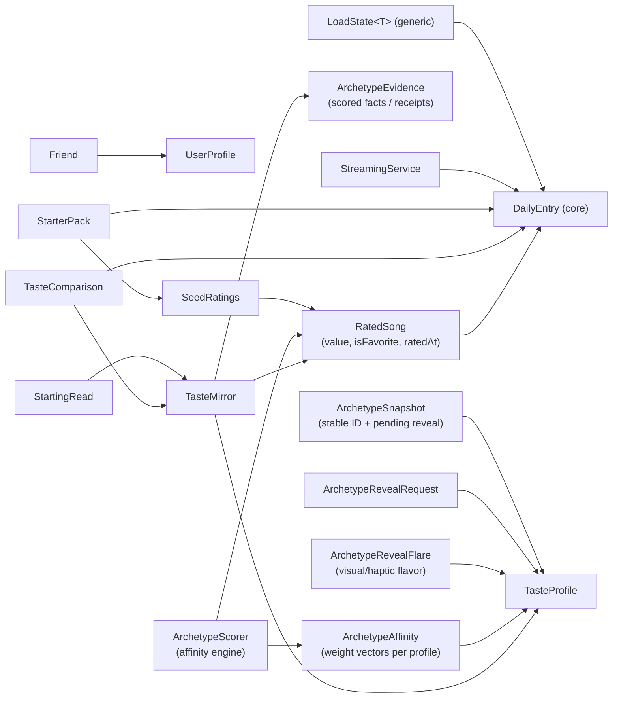

`DailyEntry` is the hub model — almost everything references it. `RatedSong`
wraps a `DailyEntry` with the user's judgment (`value`), heart flag (`isFavorite`),
and timestamp (`ratedAt` for recency decay). `TasteMirror` (the insights payload)
and `TasteComparison` (friend insights) are the two derived aggregates.
`ArchetypeScorer` produces the winning archetype + `ArchetypeEvidence` (raw
facts that power the receipts copy); `ArchetypeAffinity` holds each archetype's
weight vectors. `ArchetypeSnapshot` stabilizes the displayed archetype (persisted
via `ArchetypeSnapshotStore`); `ArchetypeRevealFlare` provides per-archetype
visual/haptic data for the reveal animation. See [Models/](Daily%20Music/Models).

---

## 6. Quick "where do I look?" index

| Symptom | Start here |
|---|---|
| Wrong data everywhere / mock vs live | [AppEnvironment](Daily%20Music/App/AppEnvironment.swift), [Daily_MusicApp](Daily%20Music/Daily_MusicApp.swift) |
| Stuck on splash / wrong screen after launch | [RootView](Daily%20Music/App/RootView.swift) (`resolveLaunchState`) |
| Sign-in / session issues | [SessionStore](Daily%20Music/ViewModels/SessionStore.swift) → [SupabaseAuthService](Daily%20Music/Services/Supabase/SupabaseAuthService.swift) |
| Onboarding re-appears / won't dismiss | [RootView](Daily%20Music/App/RootView.swift) `needsOnboarding` + [OnboardingConfig](Daily%20Music/App/OnboardingConfig.swift) + `profiles.onboarded_at` |
| Today's pick / check-in wrong | [TodayViewModel](Daily%20Music/ViewModels/TodayViewModel.swift) |
| Calendar / history gaps | [VaultViewModel](Daily%20Music/ViewModels/VaultViewModel.swift), `daily_entries` |
| Favorite toggling not sticking | [FavoritesStore](Daily%20Music/ViewModels/FavoritesStore.swift) + `favourites` table |
| Ratings / reactions not saving | [RatingBar](Daily%20Music/Views/RatingBar.swift) / [ReactionsBar](Daily%20Music/Views/ReactionsBar.swift) (inline models) |
| Friend requests / badge wrong | [FriendsStore](Daily%20Music/ViewModels/FriendsStore.swift), `my_friends` / `incoming_requests` |
| Nudges not sending | [FriendNudgeStore](Daily%20Music/ViewModels/FriendNudgeStore.swift) → edge fn `send-friend-nudge` |
| Playback silent / wrong track | [MusicPlayer](Daily%20Music/Services/MusicPlayer.swift) + [PreviewMusicEngine](Daily%20Music/Services/Music/PreviewMusicEngine.swift) |
| Settings not persisting | [SettingsViewModel](Daily%20Music/ViewModels/SettingsViewModel.swift) (UserDefaults + debounced `profiles` sync) |
| Avatar upload fails | [AvatarPickerView](Daily%20Music/Views/Components/AvatarPickerView.swift) → [ProfileStore](Daily%20Music/ViewModels/ProfileStore.swift) → storage `avatars` |
| `PGRST204` errors | a SQL migration wasn't applied in the Supabase dashboard (see CLAUDE/memory) |
| Archetype reveal never fires / fires again after 7 days | [ArchetypeSnapshot](Daily%20Music/Models/ArchetypeSnapshot.swift) (`ArchetypeSnapshotEvaluator`) + [ArchetypeSnapshotStore](Daily%20Music/Services/ArchetypeSnapshotStore.swift) (`UserDefaults` key `insights.archetypeSnapshot`) |
| Wrong archetype shown on Insights screen | [InsightsViewModel](Daily%20Music/ViewModels/InsightsViewModel.swift) `stableArchetype` — comes from snapshot, not live mirror |
| Archetype reveal animation looks wrong / missing flare | [ArchetypeRevealFlare](Daily%20Music/Models/ArchetypeRevealFlare.swift) `flares` dict — check that the `TasteProfile` has an entry |
| Archetype score feels wrong / favorites not influencing | [ArchetypeAffinity](Daily%20Music/Models/ArchetypeAffinity.swift) weight vectors + `ArchetypeScorer.score()` — check `isFavorite` is being set by the VM and that `favoriteBoost`, `halfLifeDays`, `stickyMargin` constants look right |
| Glass effects not rendering | [Styles.swift](Daily%20Music/DesignSystem/Styles.swift) — requires iOS 26+ (`glassEffect` API) |
| Streak pill wrong / missing on Today | [Streak](Daily%20Music/Models/Streak.swift) (`Streak.compute`) ← `check_ins` via [TodayViewModel](Daily%20Music/ViewModels/TodayViewModel.swift) |
| Reminders fire with stale/identical copy | [ReminderCopy](Daily%20Music/Models/ReminderCopy.swift) + `LocalNotificationService` rolling window + `MainTabView.refreshReminderWindow()` |
| Archive "N listened" badge missing | rpc `listener_count_on` not applied — run `docs/superpowers/specs/archive-listener-counts.sql` in the dashboard |
| Widget empty / never updates | [TodayDropWidget](DailyMusicWidget/TodayDropWidget.swift) provider — REST fetch with widget's own `SupabaseConfig.swift` (gitignored; recreate if missing) |
| Full tracks not playing for a subscriber | `MusicPlayer.startFresh` routing + [AppleMusicSession](Daily%20Music/Services/Music/AppleMusicSession.swift) capabilities + `FeatureFlags.appleMusicConnect` (engine isn't even constructed when off) |
| Save button missing on entry detail | `.librarySave` capability — needs connected **and** subscribed, plus the feature flag |
| Editorial notes missing in info sheet | `EnrichedCatalogInfoService` gating (`.richMetadata`) — falls back to plain iTunes lookup on any MusicKit failure |
| Spotify connect fails / row stuck on Connect | [SpotifyAuthenticator](Daily%20Music/Services/Music/Spotify/SpotifyAuthenticator.swift) — redirect URI must match the dashboard registration character-exactly (`dailymusic://spotify-callback`) |
| Spotify save fails with the dev-mode message (403) | The account isn't allowlisted — Spotify dashboard → app → User Management |
